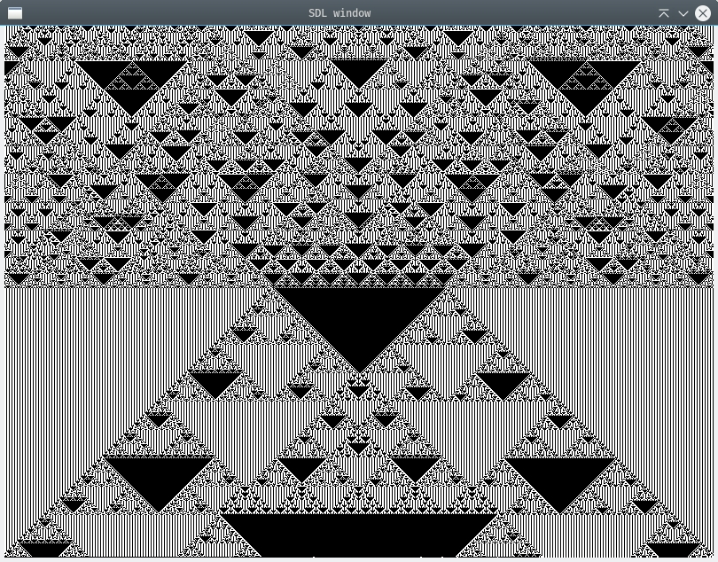

# Descrption
A simple implementation of cellular automata such as (Conway's Game of Life and elementary cellular automata)
- I tested and compiled on linux

## Dependencies
- gcc (GNU C compiler)
- sh ( shell scripting language)
- SDL2 (A graphics library for C)

## Compile and run
```console
./build.sh
./main

```

## Some images




## References
[Conway's Game of Life](https://www.en.wikipedia.org/wiki/Conway's_Game_of_Life)
[Elementary cellular automata](https://www.en.wikipedia.org/wiki/Elementary_cellular_automaton)
